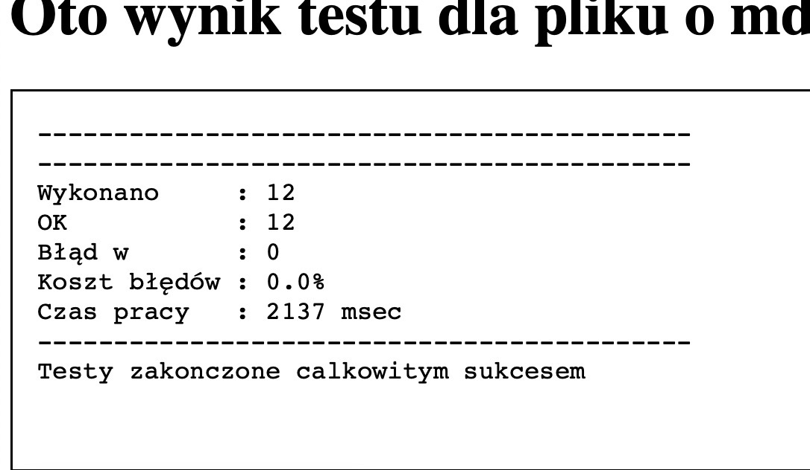

# Assignment 02

## Task Idea

Find the exit from an unknown labyrinth.

## Problem Description

We start a journey through an unknown labyrinth. The labyrinth has many paths arranged on one level of a game board. The
board is divided into square fields (locations) of the same size. Some paths are dead ends, and some introduce loops.

Additionally, there is no direct access to the labyrinth. Exploration operations can be delegated to my software, but it
will work in a multithreaded and asynchronous manner.

An example labyrinth is shown in the image below:

The location placed in the bottom-left corner of the labyrinth has the position (row=0, col=0).

## Searching for the Exit

When searching for the exit, follow these rules:

- Do not explore the same labyrinth position multiple times.
- Do not request exploration of positions that do not directly neighbor any previously explored positions. This refers
  to the immediate horizontal and vertical neighborhood (each position has four immediate neighbors). Exploring into the
  interior of walls is not allowed!
- Explore the labyrinth in multiple places simultaneously. For example, if we know that we reached a certain position by
  going north and found out that it is adjacent to rooms to the south (the return path), east, and west, exploration
  orders for rooms to the east and west should be immediately triggered (if these rooms have not been explored yet).
- In general, always delegate exploration orders to all positions that can be explored according to the previous points.

## Feedback

Orders will be executed in the background, but the execution time is generally unknown. Later orders may finish earlier.
Orders may even finish at the same time. Each order will be executed.

Expect that each call to the `result` method of the `ResultListener` interface will be executed by a different thread.

## Defeat

Reasons for failure:

- Failure to find the exit. The search time will be limited, but the limit will be large enough for a correctly
  functioning program to find a solution.
- Continuing the search after finding the exit. This should consider the "reaction time" associated with receiving and
  processing information about finding the exit.
- Failure to adhere to the rules of searching for the exit, especially sequential work.
- Failure to receive provided information.
- Indicating an incorrect location in the labyrinth or outside it.
- Reaching a "WALL" location. This should not happen. The exploration result contains information about allowed
  directions of movement—use this information!
- Using CPU time when the program has nothing to do, i.e., when waiting for the results of orders. Unused threads must
  be put to sleep!

## Observer

Since it is unknown when an order will be executed by my code, and there are no methods for "querying," the observer
pattern must be used. The object receiving orders must be provided by you before the first order. Each order will
receive a unique number. The observer will receive information about the specified location along with the order number,
allowing the result to be associated with the order.

## Communication

Your code communicates solely through the `Employer` interface.

1. First, I provide an object compatible with the `OrderInterface`.
2. Then, I execute the `start()` method in a separate thread, which receives the initial position and the directions in
   which the search for the exit can begin. The initial position is guaranteed to be of type `PASSAGE`.
3. Your code provides an object compatible with `ResultListener` using the `setResultListener` method.
4. Now, your program can delegate exploration orders (using the `order` method).
5. My program will, at any time, provide the result of an order.
6. The last steps are repeated until the exit is found. Finding the exit should conclude the `start()` method.

## Delivering the Solution

Please provide the source code for the `ParallelEmployer` class. You can include your own methods and fields in the
class. The class should implement the `Employer` interface.

The solution file may contain other classes, but only the `ParallelEmployer` class can be public.

Do not modify the code I provide. It will be used in the form it was shared during testing.

Do not include the code I provide in the solutions. It will be available during testing.

The programs will be tested using Java version 17.

## Appendix

I added the `Location` record, which is used by the `Direction` enum. You can apply it in your solution if you wish.
It's optional.

## Test result

