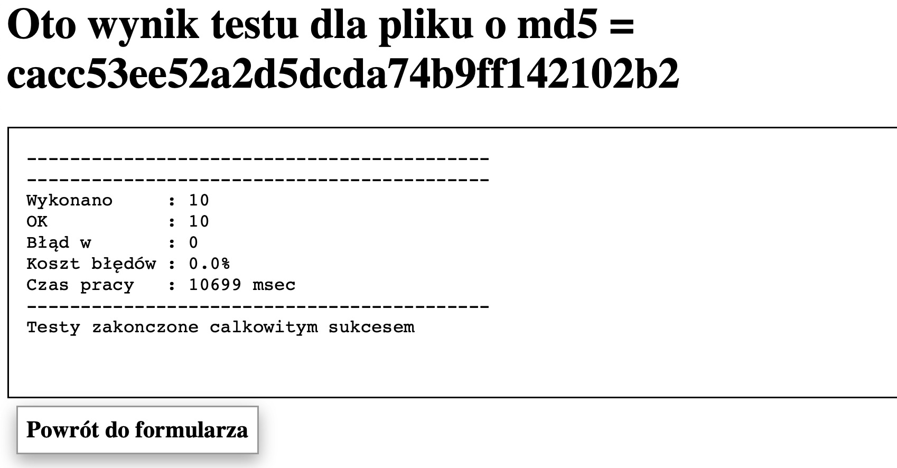

# Assignment 03

## Task Idea

Building multiple histograms simultaneously.

## Problem Description

Develop a system that allows the generation of multiple histograms at the same time by multiple concurrent users. The
system should be a distributed application, where the server is responsible for building histograms, and users (clients)
provide data.

## Communication

1. The client creates a histogram, obtaining a unique histogram identifier.
2. The client submits data for a histogram, providing the histogram identifier each time to associate the data with the
   correct histogram.
3. The client retrieves a histogram with a specified identifier.
4. The above steps can be executed by multiple clients concurrently.

## Assumptions

- The service will be registered before the first use (bind).
- A histogram will be created before submitting the first data.
- Client-submitted data must match the number of bins specified for the histogram (allowed values from 0 to bins-1).
- The `getHistogram` method will not be called before creating the histogram.
- Clients will only use valid histogram identifiers.

## Delivering the Solution

Please provide the source code for the `RMIHistogram` class, which should implement the `RemoteHistogram` and `Binder`
interfaces. You can include your own methods and fields in the class.

The solution file may contain other classes, but only the `RMIHistogram` class can be public.

Do not modify the code I provided; it will be used in its original form during testing. Do not include the provided code
in the solutions.

The programs will be tested using Java version 17.

## Test result

